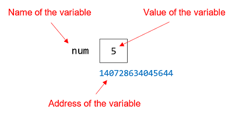
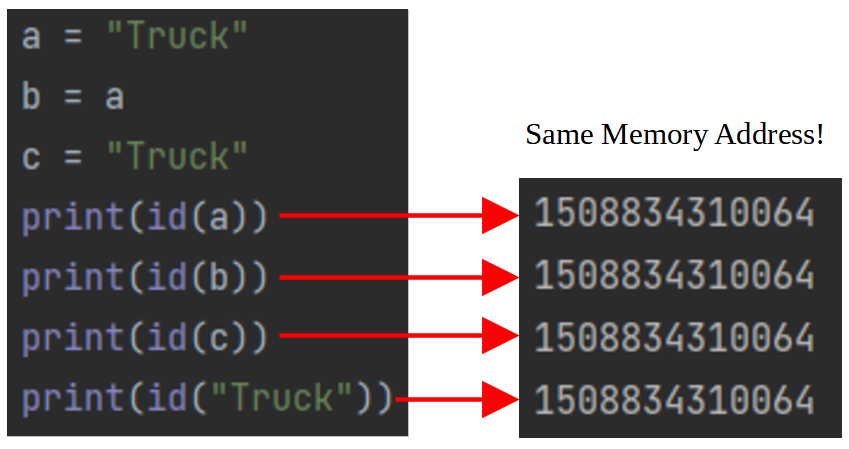
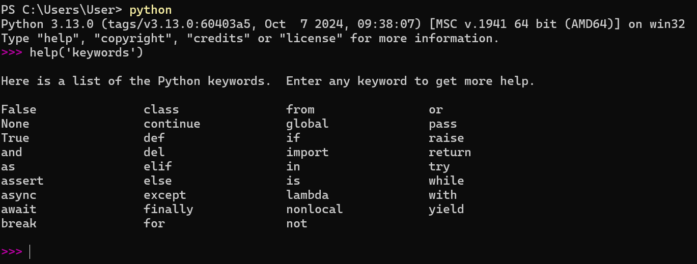
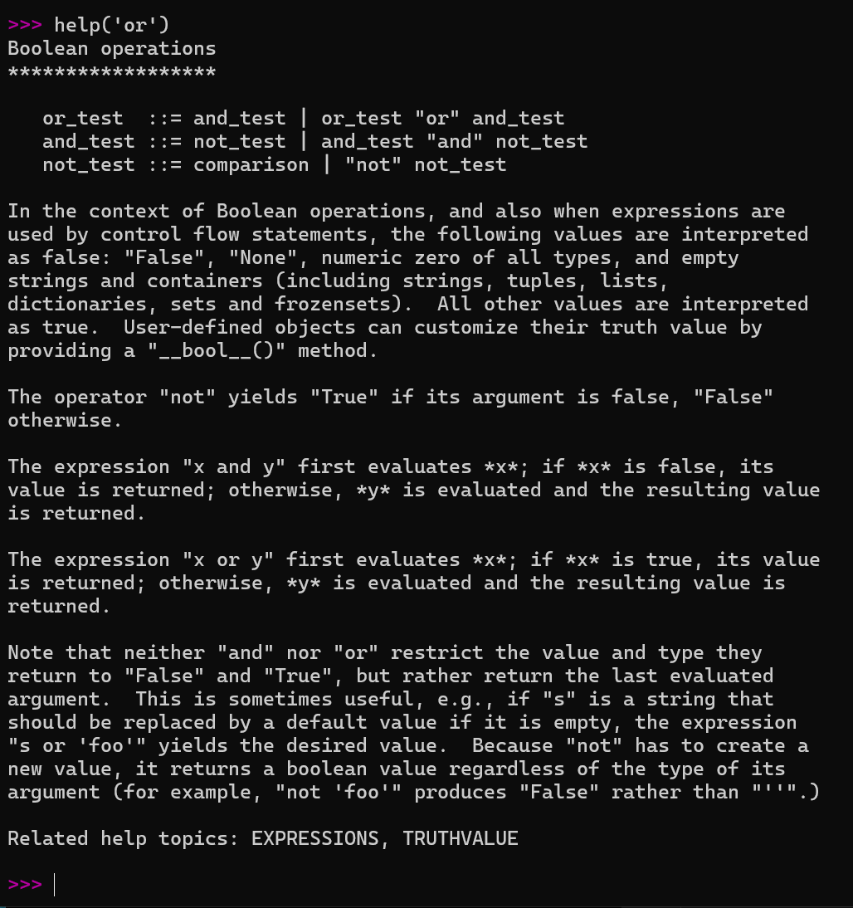
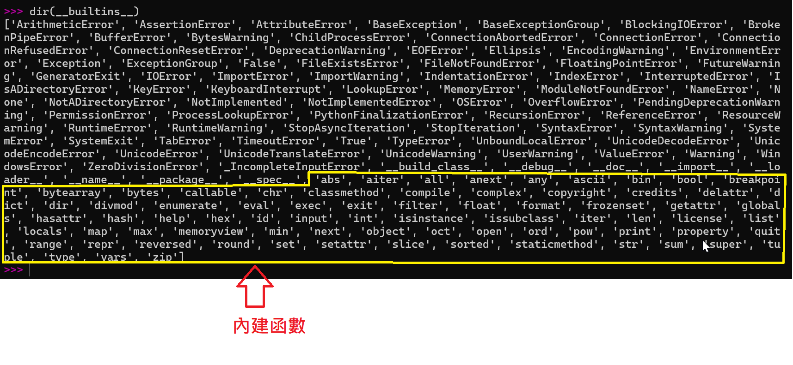
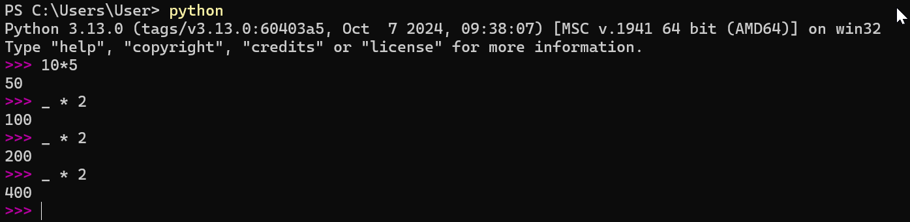

## REPL

直接輸入 python 指令會進到一個特別的環境裡，你會在每一行的前面看到 **>>>** 符號。在這裡可以直接輸入程式碼，還能馬上看到執行的結果：

```bash
$ python
Python 3.12.7 (main, Oct 17 2024, 20:07:59) [Clang 15.0.0 (clang-1500.3.9.4)] on darwin
Type "help", "copyright", "credits" or "license" for more information.
>>>
```

這個環境稱它為 **REPL**，這是「Read-Eval-Print Loop」的縮寫.

## Python 計算

輸入python進入REPL模式,練習使用REPL

```bash
$ python
Python 3.12.7 (main, Oct 17 2024, 20:07:59) [Clang 15.0.0 (clang-1500.3.9.4)] on darwin
Type "help", "copyright", "credits" or "license" for more information.
>>> x = 150
>>> print(x)
150
```

## 變數位址的意義

一般靜態語言宣告變數時,記憶體就會預留空間儲存此變數內容.  
例如: 宣告與定義 num = 5 時, 下面為記憶體內容



但對於 Python 變數所使用的是**參照(reference)位址**的觀念,  
設定一個變數 a = "Truck", Python會在記憶體某個位址儲存該內容,  
此時建立的變數就像是個**標誌(tags)**,標誌內容儲存 "Truck" 的記憶體位置,
變數a則儲存該標誌,假設有另一個變數b也是"Truck",就將變數b的標誌內容也儲存 "Truck" 的記憶體位置.  

可以使用 `id()` 函數獲得變數的記憶體位址



## 變數的命名原則

Python對於變數命名有些規則要遵守,否則會造成程式錯誤.

- 必須由英文字母或_(底線)或中文開頭,建議使用英文字母.
- 變數名稱只能由英文字母或_(底線)或中文組成, 底線開頭的變數會被特別處理.
- 英文字母大小寫是敏感的, ex: Name或name視為不同變數名稱.
- Python關鍵字或系統保留字不可當作變數名稱,會讓程式產生錯誤.
- Python內建**函數(function)**名稱或**類別(class)**名稱或**異常物件**名稱等類型不建議當變數名稱,會造成函數失效.

可使用`help('keywords')`列出所有的Python關鍵字或列出關鍵字用法.





## 不建議當作變數的函數/類別/異常物件名稱

內建函數`dir()`加上參數 `__builtins__` 可以列出所有內建函數名稱與類別名稱與異常物件名稱.



## Python 寫作風格(Python Enhancement Proposals) - PEP 8

Python之父所定義的寫作風格, 8不是版本編號, 只是PEP有許多文件提案而編號8是講Python程式設計風格.

此風格建議**便署名稱**用**小寫字母**, 若字母需用兩個英文字表達,建議文字間用**底線**連接, ex: annual salary => annual_salary

```
x = y + z     # 符合Python風格
x = (y + z)   # 符合Python風格
x=y+z         # 不符合Python風格
x=(y+z)       # 不符合Python風格
```

完整風格可參考: [https://peps.python.org/pep-0008/](https://peps.python.org/pep-0008/)

## 底線開頭或結尾的變數

- 變數名稱前有單底線, ex: _test  
  可以是一種私有**變數**、**函數**或**方法**，表示在測試中或一般應用中不想被直接使用.  
- 變數名稱後有單底線, ex: test_  
  主要是避免與Python**關鍵字(built-in keywords)**或**內建函數(built-in functions)**有相同名稱.  
  例如想建立`max`和`min`變數, 但已存在內建函數`max`和`min`, 所以可以將變數命名為`max_`和`min_`
- 變數名稱前後有雙底線, ex: __test__  
  這是保留給Python內建(built-in)的**變數**或**方法**做使用.
- 變數名稱前有雙底線, ex: __test  
  這是私有方法或變數的命名,無法直接使用本名存取資料.

> 在IDLE或REPL環境中使用Python時，底線可以代表前一次的操作遺留值



## 賦值

將一個右邊**值**或**變數**或**運算式**設定給左邊的變數，稱為`賦值(=)`運算.

```bash
Python 3.12.7 (main, Oct 17 2024, 20:07:59) [Clang 15.0.0 (clang-1500.3.9.4)] on darwin
Type "help", "copyright", "credits" or "license" for more information.
>>> x = 150     # 賦值150給x變數
>>> y = x - 10  # 將x變數的值減10後賦值給y變數
```

## 四則運算與餘數

```bash
Python 3.12.7 (main, Oct 17 2024, 20:07:59) [Clang 15.0.0 (clang-1500.3.9.4)] on darwin
Type "help", "copyright", "credits" or "license" for more information.
>>> 5 / 3
1.6666666666666667
>>> 5 // 3           # '//' 表示除法運算中只保留整數部分
1
>>> 5 + 3
8
>>> 5 - 3
2
>>> 5 * 3
15
>>> 5 % 3
2
>>> 5 ** 3           # '**' 表示次方運算
125
```

## 控制運算的優先順序

計算式同時出現在一個指令內時,除了括號"**()**"優先度最高,  
其餘計算由左至右的優先順序為:

1. 次方
2. 乘法、除法、求餘數(%)、除法求整數(//)
3. 加法、減法

```bash
Python 3.12.7 (main, Oct 17 2024, 20:07:59) [Clang 15.0.0 (clang-1500.3.9.4)] on darwin
Type "help", "copyright", "credits" or "license" for more information.
>>> x = (5 + 6) * 8 - 2
>>> x
86
>>> y = 5 + 6 * 8 - 2
>>> y
51
>>> z = 2 * 3 ** 3 * 2
>>> z
108
```

## 等號的多重指定

一次設定多個變數等於某值

```bash
>>> x = y = z = 10 # 表示將10賦值給x,y,z
```

設定多個變數與多個值

```bash
>>> x, y, z = 10, 20, 30  # 表示將10賦值給x,20賦值給y,30賦值給z
>>> x, y = y, x           # 表示將x變數與y變數交換值
```

## 列連結(Line Continuation)符號

若需要將一行指令拆分為兩行以上，可以在最後加上符號"`\`"，這符號稱**繼續符號**.  
Python直譯器會將下一列的敘述視為同一列敘述.  
注意"`\`"後面不可再加任何符號或文字,即使註解符號也不行.

另外也可在敘述內用小括號做拆行,就可以在敘述最右邊加上註解.

```bash
# 續行方法1
x = 1 +\
    2 +\
    3 +\
    4
print(x)

# 續行方法2
y = ( 1 +  # 此處可以加註解
      2 +
      3 +
      4 )
print(y)

# 續行方法3    #PEP 8風格
a = 1 \
    + 2 \
    + 3 \
    + 4
print(a)

# 續行方法4    #PEP 8風格
b = ( 1  # 此處可以加註解
      + 2
      + 3
      + 4 )
print(b)
```

## 練習

練習執行Python應用

```bash
$> python .\02\src\02.py
```

## Python 內建函數與標準模組與三方模組

1. 內建函數: 可以直接使用, ex: print(), id(), help(), dir(), ...
2. 標準模組函數(或變數): 安裝Python時，已經被安裝，例如: math模組, 但使用前需用 `import xxx` 來導入此模組
3. 三方模組: 可以擴充Python功能的模組內的函數,這類函數在使用前需要先安裝模組,然後才可以用`import`導入此模組作使用
